# Introduction to Networking

## Definition

Computer networking refers to the `communication` between multiple devices, such as `computers`, `servers`, and `mobile devices`, that are connected through various types of `communication channels`, such as `wired or wireless` connections. The primary goal of computer networking is to facilitate the exchange of `data` and `information` between devices, no matter where they are located.

Networking technologies enable devices to `share resources`, such as `printers`, `files`, and `applications`, and to access information stored on remote servers or in the cloud. Computer networking is essential for many aspects of modern life, including `communication`, `business`, `education`, and `entertainment`.

Networking `protocols`, such as `TCP/IP`, enable devices to communicate with each other and transfer data `reliably and efficiently`. Networking devices, such as `routers`, `switches`, and `firewalls`, provide the necessary `infrastructure` for data to flow between devices` securely and effectively`.

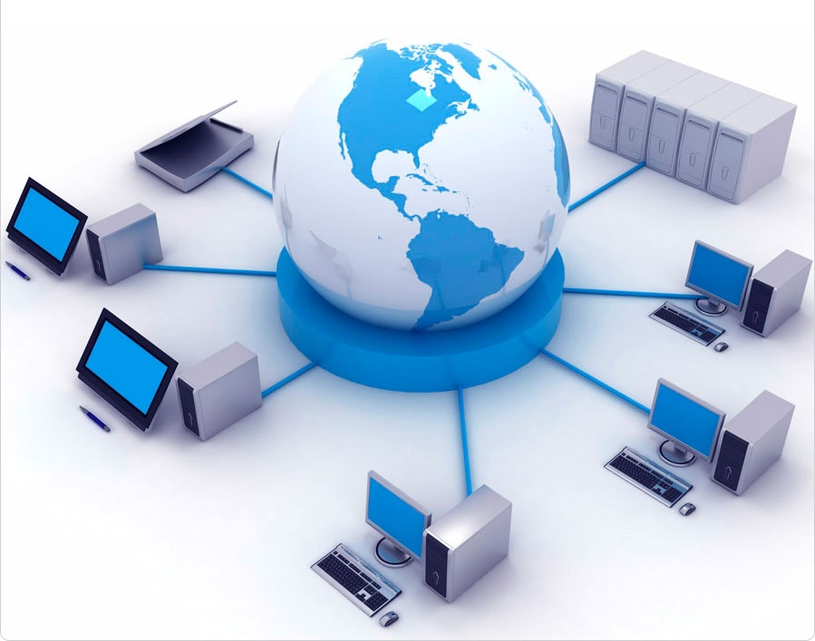

## Types of Networking

- `Local Area Network (LAN)`: A LAN is a network that connects devices within a limited geographical area such as a home, office, or campus. It is used for sharing resources and information among devices in the same location.

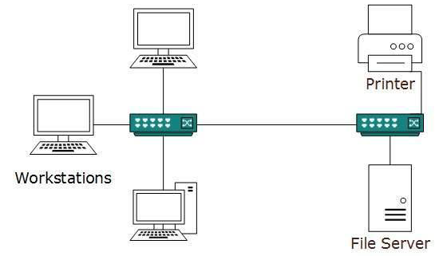

- `Wide Area Network (WAN)`: A WAN is a network that connects devices over a large geographical area such as multiple cities or even countries. It is typically used for connecting different LANs and providing access to the Internet.

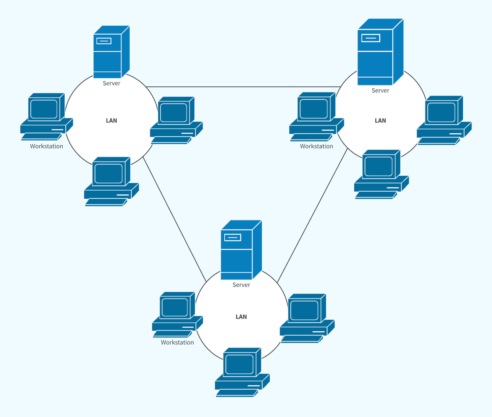

- `Metropolitan Area Network (MAN)`: A MAN is a network that covers a larger geographical area than a LAN but smaller than a WAN. It is typically used to connect multiple LANs within a city or a region.

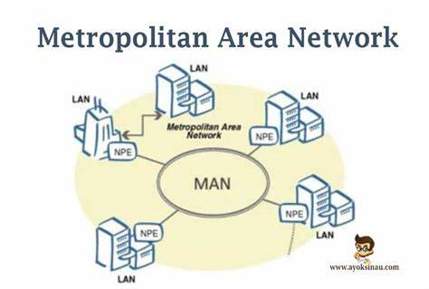

- `Wireless Local Area Network (WLAN)`: A WLAN is a LAN that uses wireless technology to connect devices. It is commonly used for mobile devices such as smartphones and tablets.

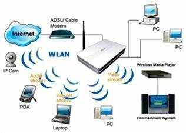

- `Personal Area Network (PAN)`: A PAN is a network that connects devices within a very limited range, such as a few meters. It is typically used for connecting personal devices such as smartphones and laptops.

- `Storage Area Network (SAN)`: A SAN is a specialized network that provides access to storage devices such as hard drives and tape drives. It is commonly used in data centers and enterprise environments.

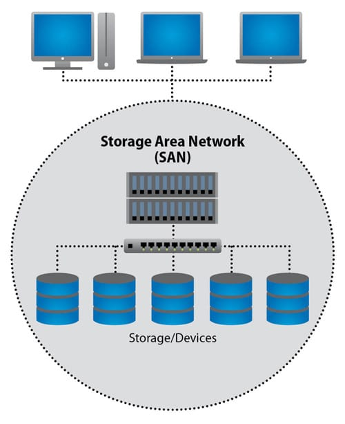

- `Virtual Private Network (VPN)`: A VPN is a network that provides secure access to a private network over the Internet. It is commonly used by remote workers and for secure communications between different locations.

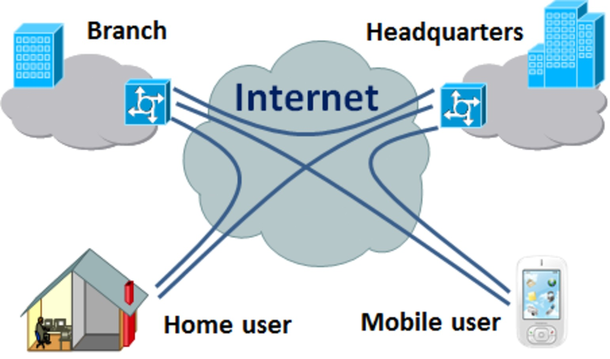

## Benifits of Computer Networking

There are many benefits of computer networking, including:

- `Communication`: Networking allows people and devices to communicate with each other, which can be beneficial for business, education, research, and personal communication.

- `Resource sharing`: Networks allow resources such as printers, scanners, and storage devices to be shared among multiple users. This can reduce costs and increase efficiency.

- `Collaboration`: Networks enable people to work together on projects and share information easily. This can lead to more innovation and better results.

- `Access to information`: Networks provide access to a vast amount of information that would not be available otherwise. This can be especially important for research and education.

- `Security`: Computer networking involves security measures that help to protect data and prevent unauthorized access. This is crucial for maintaining privacy and preventing cyber attacks.

- `Scalability`: Networks can be easily expanded as the number of users and devices grows. This can be beneficial for businesses and organizations that need to accommodate increasing demands.

- `Remote access`: Networking can allow remote access to data and resources, which can be helpful for employees who need to work from home or from other locations.

## Network topologies

Network topology refers to the `physical or logical` arrangement of `devices and cables` in a `network`. There are several types of network topologies, including:

- `Bus topology`: In a bus topology, devices are connected to a single cable, which serves as a shared communication medium. This topology is simple and easy to set up, but it can suffer from performance issues if too many devices are connected to the same cable.
    - __Advantages__  
        1. Easy to set up and understand  
        2. Low cost, as it requires less cabling

    - __Disadvantages__  
        1. Limited scalability due to performance issues if too many devices are added to the network  
        2. A break in the main cable can bring down the entire network  
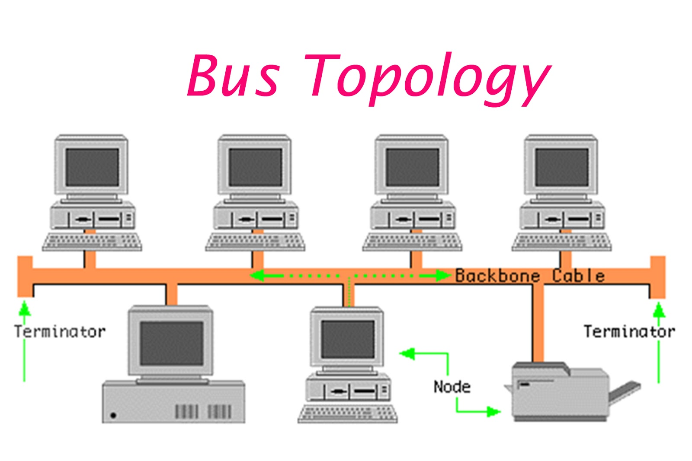

- `Star topology`: In a star topology, devices are connected to a central hub or switch. This topology is easy to manage and can be easily expanded, but it can suffer from a single point of failure if the central hub or switch fails.

    - __Advantages__
        1. Easy to manage and troubleshoot
        2. Centralized control with a hub or switch, making it easier to monitor   network traffic
    - __Disadvantages__
        1. Single point of failure in the central hub or switch
        2. More cabling is required than in a bus topology, which can increase cost

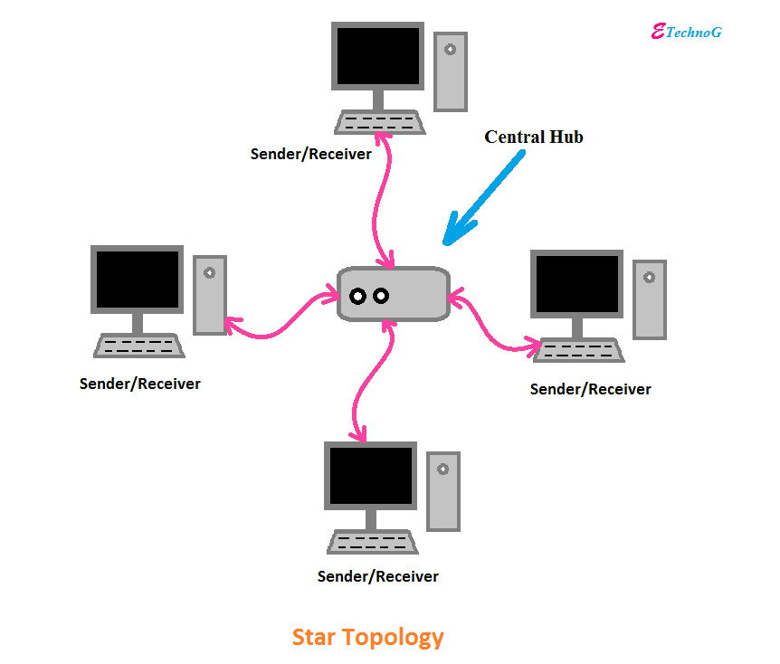

- `Ring topology`: In a ring topology, devices are connected in a closed loop, with each device connected to its two neighboring devices. This topology is efficient and can provide high-speed communication, but it can suffer from performance issues if too many devices are added to the network.

    - __Advantages__
        1. High performance due to efficient data transfer
        2. Simple, easy-to-understand topology
    - __Disadvantages__
        1. A break in the ring can bring down the entire network
        2. Adding or removing devices can disrupt the entire network

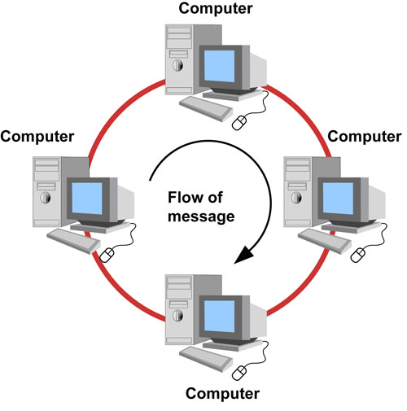

- `Mesh topology`: In a mesh topology, devices are connected to multiple other devices, forming a complex network of interconnected devices. This topology provides redundancy and can be highly resilient, but it can be difficult to manage and can require a lot of cabling.

    - __Advantages__
        1. High fault tolerance due to multiple connections between devices
        2. Scalable and can handle a large number of devices
    - __Disadvantages__
        1. Complex and expensive to implement, requiring a lot of cabling
        2. Difficult to manage and troubleshoot due to the large number of connections

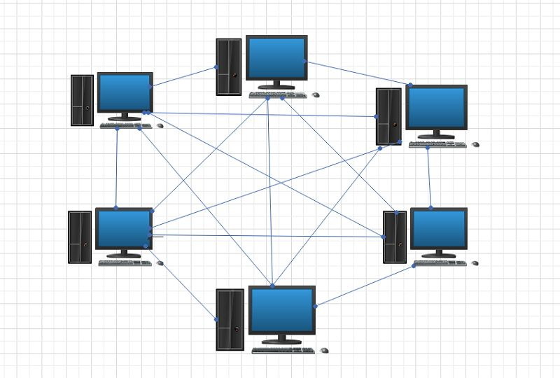

- `Hybrid topology`: A hybrid topology is a combination of two or more of the above topologies. For example, a hybrid topology may combine elements of a star topology and a mesh topology. This topology can provide the benefits of multiple topologies, but it can also be more complex to manage.

    - __Advantages__
        1. Can combine the benefits of multiple topologies to meet specific needs
        2. Can be more resilient than a single topology alone
    - __Disadvantages__
        1. Can be complex to set up and manage
        2. May require additional hardware and cabling, increasing cost

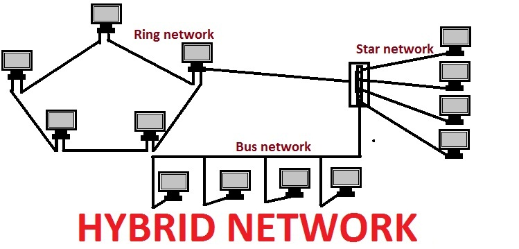

## Network components

Here are some common network components:

- `Network Interface Cards (NICs)`: These are the physical devices that connect computers and other devices to the network. They are typically installed in a computer's motherboard or connected via USB or other ports.

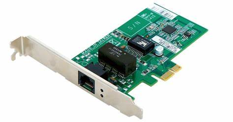

- `Switches`: Switches are used to connect multiple devices within a network. They can be used to control the flow of data between devices and ensure that data is sent to the correct device.

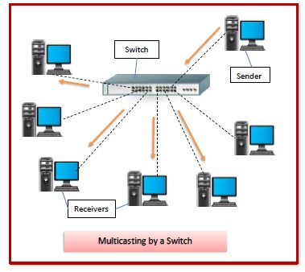

- `Routers`: Routers are used to connect different networks and route data between them. They can be used to connect a local network to the Internet or to connect multiple local networks together.

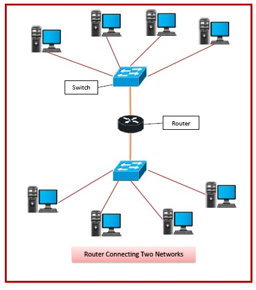

- `Firewalls`: Firewalls are used to protect a network from unauthorized access and cyber attacks. They can be hardware or software-based and can control access to the network based on various criteria such as IP addresses, ports, and protocols.

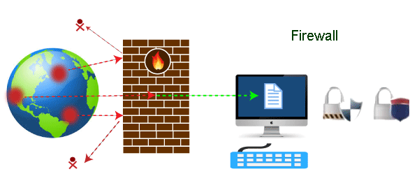

- `Hubs`: Hubs are similar to switches, but they are less intelligent and simply broadcast data to all connected devices. They are not commonly used in modern networks.

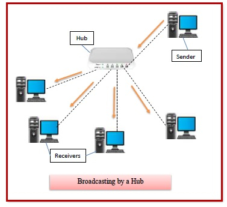

- `Modems`: Modems are used to connect a network to the Internet via a telephone line or other communication channel. They can be used to translate digital data into analog signals for transmission over a phone line and vice versa.

- `Wireless Access Points (WAPs)`: WAPs are used to provide wireless connectivity to a network. They allow devices to connect to the network via Wi-Fi and can be used to extend the range of a wireless network.

- `Servers`: Servers are computers or devices that provide services to other devices on the network. They can be used to store and share files, host websites or applications, and manage network resources.

These are just some of the common network components used in modern computer networks. The specific components used will depend on the needs of the network and the devices connected to it.
